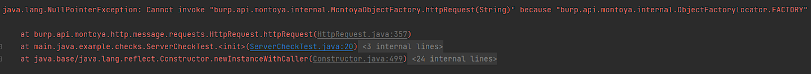

--- 
title: Writing JUnit Tests for Custom Burp Extensions
date: 2023-10-07 18:00:00 -0600
author: anthony   
categories: [Development, Burp Suite Extensions]
tags: [dev work, burp suite]     # TAG names should always be lowercase
description: Learn how to write JUnit tests for Burp Suite extensions, avoid common pitfalls, and optimize your development workflow.
---

## Why Write JUnit Tests for Burp Suite
---------------------------------------

Sometimes extensions are so small and simple that test cases aren't necessary. If this is the case, I would recommend Burp Suite's new **BChecks**, which allows users to easily create simple Scan Checks. **BChecks** is in the early release stage, so its functionality is limited compared to the **Montoya API**. Some examples of BChecks put together by Burp's community can be found in the [BChecks collection for Burp Suite Professional](https://github.com/PortSwigger/BChecks).

However, if you want to write more complex Burp Suite extensions, I'd highly recommend using **JUnit tests** to speed up development. Writing JUnit test cases can be faster than adding the extension to Burp Suite to manually test specific functions. For larger projects, it can also help identify breaking changes. While there are many benefits to writing JUnit tests, actually creating these test cases for Burp Suite extensions can be a bit different than I expected when I first started working on my own.

## Difficulties
---------------

For some background, the **Montoya API** is a library of interfaces. This allows developers to use the skeleton objects without revealing exactly how Burp Suite implements these interfaces. From a security-first perspective, this is a safe method of exposing an API. From a developer’s perspective, this makes writing test cases a little tedious since one cannot initialize unimplemented interfaces.

### API Object Initialization Error
If you use an API object, you’ll likely run into initialization errors.


## How to Write JUnit Tests for Burp Suite Extensions
-----------------------------------------------------

It's best to create functions that take in Java standard objects like `String`, `List`, etc., as arguments, instead of passing in Burp Suite API objects. The reason is that Burp Suite API objects are unimplemented interfaces that would require mocking.

### Example: Function with a Burp Object as a Parameter
```java
private boolean verifier(Header header) {    
    return commonWebServerHeaders.contains(header.name()) && !header.value().isBlank() && !allowedServerValues.contains(header.value());
}
```

### Example: Function with Standard Java Objects as Parameters
```java
private boolean verifier(String headerName, String headerValue) {
    return commonWebServerHeaders.contains(headerName) && !headerValue.isBlank() && !allowedServerValues.contains(headerValue);
}
```

By using standard Java objects as parameters, you can simplify your test case creation and avoid having to mock Burp Suite API objects, which speeds up your development process.

## Additional Resources
------------------------

- [Portswigger Resources on Extending Burp](https://portswigger.net/burp/documentation/desktop/extensions)
- [Portswigger Forum post on JUnit](https://forum.portswigger.net/thread/junit-test-with-burp-extensions-65ae813e)
